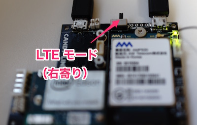
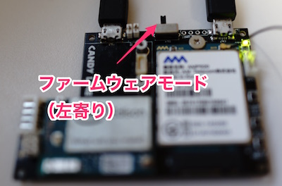

[🔙目次ページへ戻る](README.md)

## CANDY IoTでEdisonのファームウェアを更新する

[CANDY IoT](http://www.candy-line.io/proandsv.html#candyiot)を通してEdisonのファームウェアをお使いのパソコンから更新することができます。

### ファームウェアをダウンロードする

- [Intel® Edison Module Firmware Software Release 3.5](https://downloadmirror.intel.com/26028/eng/iot-devkit-prof-dev-image-edison-20160606.zip)**＜推奨＞**
- [Release 2.1 Yocto complete image (poky-yocto)](http://downloadmirror.intel.com/25384/eng/edison-iotdk-image-280915.zip)

上記のリンクからZIPファイルをダウンロードして展開しましょう。3.5のバージョンと2.1のバージョンがあります。特に理由がない場合は、3.5の方をダウンロードしましょう。

### 【重要!】CANDY IoTをファームウェア更新モードにする

[CANDY IoT](http://www.candy-line.io/proandsv.html#candyiot)にはモード切り替えスイッチが付いています。これを切り替えると、通常のLTEモードと、ファームウェアを書き込むモードとを変更することができます。



このようになっていれば、LTEモードになっているので、切り替えて、次のような位置になるようにしましょう。



このような位置であれば、ファームウェアを書き込むモードになっていますので準備完了です。

### ファームウェアを更新する

続いて、[CANDY IoT](http://www.candy-line.io/proandsv.html#candyiot)を **パソコンから外した状態で** 以下の手順を行ってください。
もしつないだまま作業をした場合は、以下の手順で接続するタイミングがありますので、その時に一旦切断して、また接続し直すようにしてください。

ここからは、お使いのOSによって方法が異なりますので、以下の中から当てはまる方法をお試しください。

#### Ubuntu/Debianをお使いの場合

`dfu-util`とそれに必要なパッケージをインストールします。

```
sudo apt-get update
sudo apt-get install dfu-util
```

ファームウェアZIPファイルを展開したディレクトリーに移り、以下のコマンドを実行します。

```
cd （展開先ディレクトリー）
./flashall.sh
```

実行したら、[こちら](#flashallを実行した後は？)をご覧ください。

他のディストリビューションをお使いの場合は、ソースからビルドしていただく場合があります。[こちら](http://dfu-util.sourceforge.net)のサイトをご覧の上、dfu-utilの実行バイナリーをご用意ください。

#### Windowsをお使いの場合

Intel Communityのサイトから、[`dfu-util.exe`のZIPファイル](https://communities.intel.com/servlet/JiveServlet/download/25154-6-102797/dfu-util.exe.zip)をダウンロードします。
次に中にある`dfu-util.exe`を、イメージファイルを展開したディレクトリーの中にコピーします。

コマンドプロンプトを開いて、まずはイメージファイルを展開したディレクトリーへ移動しましょう。
```
cd （展開先ディレクトリー）
flashall.bat
```

実行したら、[こちら](#flashallを実行した後は？)をご覧ください。

#### macOSをお使いの場合

[Homebrew](http://brew.sh/index_ja.html)を利用して必要なソフトウェアをインストールします。

```
brew install dfu-util coreutils gnu-getopt
```

ファームウェアZIPファイルを展開したディレクトリーに移り、以下のコマンドを実行します。

```
cd （展開先ディレクトリー）
./flashall.sh
```

実行したら、続けて以下をご覧ください。

### flashallを実行した後は？

flashallを実行すると、以下のように表示されます。

```
Using U-Boot target: edison-blankcdc
Now waiting for dfu device 8087:0a99
Please plug and reboot the board
```

このように表示されたら、から、[CANDY IoT](http://www.candy-line.io/proandsv.html#candyiot)をパソコンに接続しましょう。
接続すると、自動的に次の処理が始まります。

```
Flashing IFWI
Download	[=========================] 100%      4194304 bytes
Download	[=========================] 100%      4194304 bytes
Flashing U-Boot
Download	[=========================] 100%       237568 bytes
Flashing U-Boot Environment
Download	[=========================] 100%        65536 bytes
Flashing U-Boot Environment Backup
Download	[=========================] 100%        65536 bytes
Rebooting to apply partition changes
Now waiting for dfu device 8087:0a99
Flashing boot partition (kernel)
Download	[=========================] 100%      6111232 bytes
Flashing rootfs, (it can take up to 5 minutes... Please be patient)
Download	[=========================] 100%    985759744 bytes
Rebooting
U-boot & Kernel System Flash Success...
Your board needs to reboot to complete the flashing procedure, please do not unplug it for 2 minutes.
```

最後まで表示されますと完了となりますが、すぐに切断してはいけません。そのままの状態で2分以上お待ちになって、そのあとで[CANDY IoT](http://www.candy-line.io/proandsv.html#candyiot)の電源を入れ直してください。この間の時間は、ファームウェア書き込みのプロセスを完全に終わらせるための時間となります。

### 【重要!】CANDY IoTをLTEモードに戻す

ファームウェアを書き込んで、2分以上経ってから、CANDY IoTをパソコンから一旦外しましょう。

続いて、[CANDY IoT](http://www.candy-line.io/proandsv.html#candyiot)のモード切り替えスイッチを、LTEモードに戻しましょう。


このようになっていれば、LTEモードに戻りましたので、CANDY IoTを電源につないで[Edisonのセットアップ](Edisonのセットアップ.md)を行いましょう。

* [インストール方法](インストール方法.md)
* [CANDY REDのインストール方法](CANDY-REDのインストール方法.md)
* [Edisonのセットアップ](Edisonのセットアップ.md)

---
注）こちらの情報は、Intel Communityに[投稿された情報](https://communities.intel.com/docs/DOC-25154)に基づいて紹介しています。

---
COPYRIGHT © 2016 CANDY LINE, Inc. [CC-BY-NC-SA 4.0](https://creativecommons.org/licenses/by-nc-sa/4.0/)
